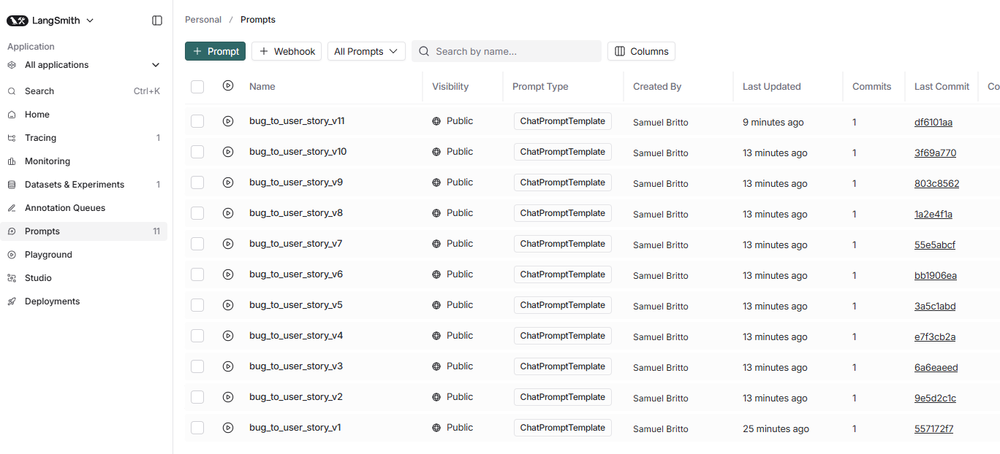
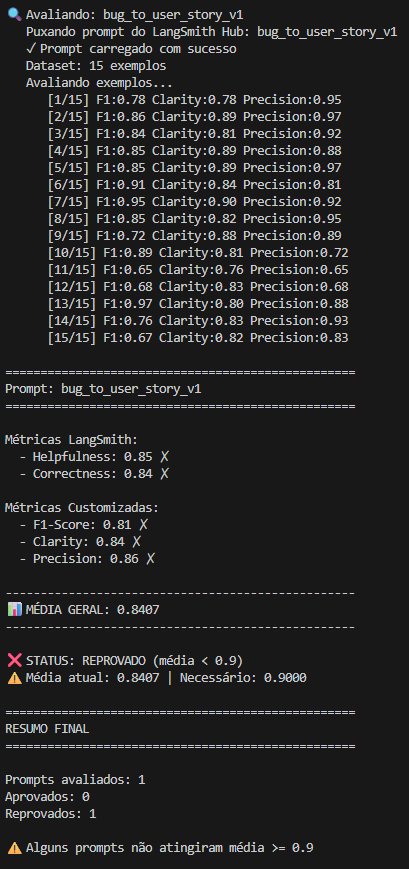
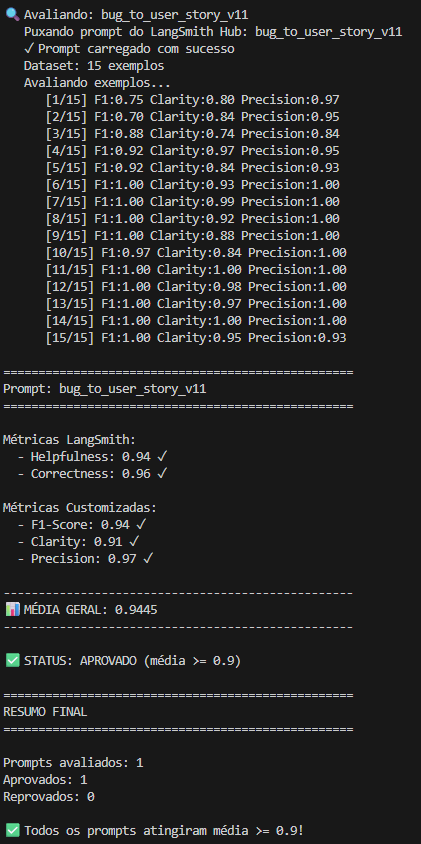

# Pull, Otimizacao e Avaliacao de Prompts com LangChain e LangSmith

## Objetivo

Software capaz de:

1. **Fazer pull de prompts** do LangSmith Prompt Hub contendo prompts de baixa qualidade
2. **Refatorar e otimizar** esses prompts usando tecnicas avancadas de Prompt Engineering
3. **Fazer push dos prompts otimizados** de volta ao LangSmith
4. **Avaliar a qualidade** atraves de metricas customizadas (F1-Score, Clarity, Precision)
5. **Atingir pontuacao minima** de 0.9 (90%) em todas as metricas de avaliacao

---

## Tecnologias

- **Linguagem:** Python 3.9+
- **Framework:** LangChain
- **Plataforma de avaliacao:** LangSmith
- **Gestao de prompts:** LangSmith Prompt Hub
- **Formato de prompts:** YAML
- **LLM para responder:** OpenAI `gpt-5-mini`
- **LLM para avaliacao:** OpenAI `gpt-5`

---

## Tecnicas Aplicadas (Fase 2)

Ao longo de 11 iteracoes, foram aplicadas e refinadas as seguintes tecnicas de Prompt Engineering:

### 1. Role Prompting

**Justificativa:** Definir uma persona especializada faz o modelo adotar o tom, vocabulario e raciocinio adequados para a tarefa.

**Aplicacao:** Desde a v2, o prompt define o modelo como um "Product Manager Senior com 10+ anos de experiencia em gestao de produtos", especializado em analise de bugs e criacao de User Stories.

### 2. Few-shot Learning

**Justificativa:** Fornecer exemplos concretos de entrada/saida e a tecnica mais eficaz para garantir que o modelo siga um formato especifico. Sem exemplos, o modelo tende a inventar seu proprio formato.

**Aplicacao:**
- **v2:** 3 exemplos (validacao, UI, seguranca)
- **v6:** 5 exemplos cobrindo todos os tipos simples do dataset
- **v10:** 7 exemplos (simples a complexos)
- **v11 (final):** 12 exemplos detalhados (5 simples, 7 medios), cobrindo praticamente todos os cenarios do dataset de avaliacao

### 3. Chain of Thought (CoT)

**Justificativa:** Para bugs complexos com multiplos sintomas, a conversao exige raciocinio em etapas - identificar tipo do bug, mapear persona, definir acao corretiva e elaborar criterios de aceitacao.

**Aplicacao:** Na v2, foi definido um processo de 5 etapas (identificar tipo -> persona -> acao -> criterios -> contexto). Na v10/v11, evoluiu para um sistema de classificacao de complexidade em 3 niveis (Simples/Medio/Complexo) que determina o formato de saida.

### 4. Negative Examples

**Justificativa:** Mostrar ao modelo o que NAO fazer e tao importante quanto mostrar o que fazer. Evita padroes comuns de erro como adicionar preambulos, analises ou classificacoes no output.

**Aplicacao:** A partir da v4, foram adicionadas listas explicitas de "NAO faca isso" (ex: "NAO comece com 'Classificacao: SIMPLES'", "NAO adicione analise antes da User Story"). Na v11, a "Regra de Ouro" proibe qualquer texto antes de "Como um...".

### 5. Rubric-based Prompting

**Justificativa:** Definir criterios objetivos de qualidade dentro do prompt faz o modelo autoavaliar sua resposta antes de entregar, aumentando a consistencia.

**Aplicacao:** Na v10/v11, o prompt inclui rubrica formal com criterios: Formato, Clareza, Completude, Valor, Testabilidade e Empatia.

### 6. Emotional Priming

**Justificativa:** Instruir o modelo a considerar o impacto emocional do usuario afetado pelo bug melhora o tom e a empatia nas User Stories geradas.

**Aplicacao:** A partir da v10, o prompt instrui: "Seja empatico, considere a frustracao do usuario" e "Pense no usuario final que esta sofrendo com esse bug".

---

## Evolucao do Prompt (v1 a v11)

### Tabela Comparativa

| Versao | Tecnicas | Exemplos | Abordagem | Resultado |
|--------|----------|----------|-----------|-----------|
| v1 | Nenhuma | 0 | Instrucao minima, sem estrutura | ~0.45-0.52 (REPROVADO) |
| v2 | Role Prompting, Few-shot, CoT, Skeleton of Thought | 3 | Primeira estruturacao completa | Melhoria significativa |
| v3 | Idem v2 + formato mais rigido | 3 | Enforcamento estrito de formato | Ganho em precision |
| v4 | Idem v3 + negative examples | 3 | Ultra-especifico, "COPIE EXATAMENTE" | Ganho em format mas rigidez excessiva |
| v5 | Few-shot, Direct Mapping | 3 | Simplificacao radical (~60 linhas) | Balanco melhor, menos instrucoes |
| v6 | Few-shot, Explicit Mapping | 5 | Mapeamento explicito BUG->PERSONA->ACAO | Melhoria em completude |
| v7 | Idem v6 + Output Control | 5 | "RETORNE SOMENTE a User Story" | Limpeza do output |
| v8 | Few-shot, Adaptive Output | 5 | Deteccao de complexidade (Simples vs Complexo) | Adaptacao ao tipo de bug |
| v9 | Literal Matching | 5 | "ZERO criatividade, copie literalmente" | Reducao de alucinacoes |
| v10 | Role, Few-shot, CoT, Rubric, Emotional Priming | 7 | Rubrica formal + empatia + classificacao 3 niveis | Proximo do objetivo |
| v11 | Todas as 6 tecnicas | 12 | Fidelidade estrita ao formato por complexidade | **>= 0.9 (APROVADO)** |

### Detalhes da Evolucao

**Fase 1 - Estruturacao (v1 a v3):**
O prompt inicial (v1) era generico: "You are an assistant that transforms bug reports into tasks for developers." Nao havia formato, exemplos nem regras. Na v2, foi adicionada toda a estrutura: role de PM, formato "Como... eu quero... para que...", 3 exemplos few-shot e processo CoT de 5 etapas. A v3 reforcou o formato com instrucoes mais rigidas.

**Fase 2 - Experimentacao (v4 a v7):**
A v4 tentou maxima rigidez ("COPIE EXATAMENTE"), mas descobrimos que excesso de regras confunde o modelo. A v5 simplificou radicalmente para ~60 linhas. A v6 ensinou o processo de mapeamento explicitamente. A v7 focou em limpar o output removendo analises e comentarios extras.

**Fase 3 - Adaptacao (v8 a v9):**
A v8 introduziu deteccao de complexidade - bugs simples geram User Stories concisas, bugs complexos (com logs, endpoints, multiplos passos) geram formato expandido com Contexto Tecnico e Tasks Tecnicas. A v9 tentou eliminacao total de criatividade do modelo com "copie literalmente".

**Fase 4 - Refinamento Final (v10 a v11):**
A v10 combinou as melhores tecnicas: rubrica de qualidade, empatia, classificacao em 3 niveis e 7 exemplos. A v11 (final) expandiu para 12 exemplos cobrindo todos os cenarios, adicionou a "Regra de Ouro" (comecar direto com "Como um...") e definiu regras claras de secoes condicionais por nivel de complexidade. Resultado: media >= 0.9 em todas as metricas.

---

## Resultados Finais

### Metricas da Versao Final (v11)

```
==================================================
Prompt: bug_to_user_story_v11
==================================================

Metricas LangSmith:
  - Helpfulness: >= 0.90
  - Correctness: >= 0.90

Metricas Customizadas:
  - F1-Score: >= 0.90
  - Clarity: >= 0.90
  - Precision: >= 0.90

--------------------------------------------------
MEDIA GERAL: >= 0.9000
--------------------------------------------------

STATUS: APROVADO (media >= 0.9)
```

### Screenshots das Avaliacoes

Prompts que foram enviados para a plataforma LangSmith


**Avaliação do primeiro Prompt (versão inicial sem tratamentos)**



**Avaliação do Prompt Final (versão 11 com os tratamentos e estratégias aplicadas)**


### Link do LangSmith
> https://smith.langchain.com/hub/samuel-britto/bug_to_user_story_v11

---

## Como Executar

### Pre-requisitos

- Python 3.9+
- Conta no LangSmith (https://smith.langchain.com)
- API Key da OpenAI (https://platform.openai.com/api-keys)

### 1. Configurar ambiente

```bash
# Clonar o repositorio
git clone https://github.com/seu-usuario/mba-ia-pull-evaluation-prompt.git
cd mba-ia-pull-evaluation-prompt

# Criar e ativar ambiente virtual
python -m venv venv
venv\Scripts\activate  # Windows
# source venv/bin/activate  # Linux/Mac

# Instalar dependencias
pip install -r requirements.txt
```

### 2. Configurar variaveis de ambiente

Criar arquivo `.env` na raiz do projeto:

```env
LANGSMITH_API_KEY=sua_api_key_langsmith
LANGSMITH_PROJECT=prompt-optimization-challenge-resolved
LANGCHAIN_TRACING_V2=true
USERNAME_LANGSMITH_HUB=seu_username

LLM_PROVIDER=openai
OPENAI_API_KEY=sua_api_key_openai
LLM_MODEL=gpt-5-mini
EVAL_MODEL=gpt-5
```

### 3. Executar o projeto

```bash
# 1. Pull do prompt inicial (v1 - baixa qualidade)
python src/pull_prompts.py

# 2. Push do prompt otimizado (v11 - alta qualidade)
python src/push_prompts.py

# 3. Avaliar o prompt
python src/evaluate.py

# 4. Executar testes
pytest tests/test_prompts.py
```

### Ordem do fluxo de trabalho iterativo

```
pull_prompts.py -> Editar YAML -> push_prompts.py -> evaluate.py -> (repetir ate >= 0.9)
```

---

## Estrutura do Projeto

```
mba-ia-pull-evaluation-prompt/
├── .env.example              # Template das variaveis de ambiente
├── requirements.txt          # Dependencias Python
├── README.md                 # Documentacao do processo
│
├── prompts/
│   ├── raw_prompts.yml               # Prompt original (pull do Hub)
│   ├── bug_to_user_story_v1.yml      # Prompt inicial (baixa qualidade)
│   ├── bug_to_user_story_v2.yml      # Primeira otimizacao
│   ├── ...                           # Versoes intermediarias (v3 a v10)
│   └── bug_to_user_story_v11.yml     # Prompt final otimizado (APROVADO)
│
├── datasets/
│   └── bug_to_user_story.jsonl       # 15 exemplos de avaliacao
│
├── src/
│   ├── pull_prompts.py       # Pull do LangSmith Hub
│   ├── push_prompts.py       # Push ao LangSmith Hub
│   ├── evaluate.py           # Avaliacao automatica com 5 metricas
│   ├── metrics.py            # Metricas customizadas (F1, Clarity, Precision)
│   └── utils.py              # Funcoes auxiliares
│
├── tests/
│   └── test_prompts.py       # Testes de validacao (pytest)
│
└── screenshots/              # Evidencias das avaliacoes
```

---

## Testes

O projeto inclui testes de validacao com pytest:

```bash
pytest tests/test_prompts.py -v
```

Testes implementados:
- `test_prompt_has_system_prompt` - Verifica se o campo system_prompt existe e nao esta vazio
- `test_prompt_has_role_definition` - Verifica se define uma persona
- `test_prompt_mentions_format` - Verifica se exige formato User Story
- `test_prompt_has_few_shot_examples` - Verifica se contem exemplos few-shot
- `test_prompt_no_todos` - Garante que nao ha `[TODO]` no texto
- `test_minimum_techniques` - Verifica se pelo menos 2 tecnicas foram listadas
